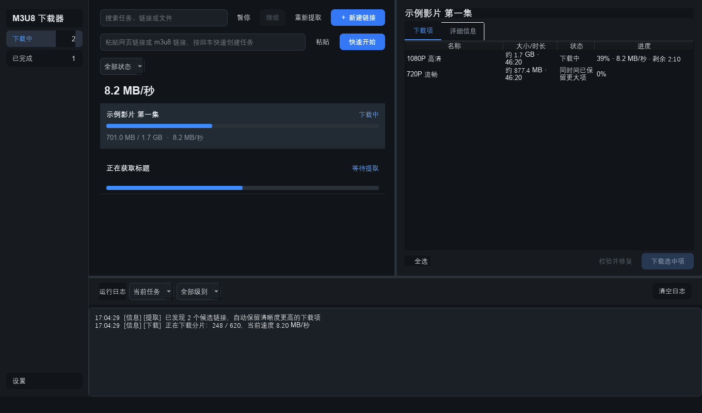

<p align="center">
  
</p>

<h1 align="center">M3U8 下载器</h1>

<p align="center">面向 Windows 的网页视频提取、M3U8 下载与任务管理工具。</p>



程序把一个网页或一条 M3U8 直链作为父任务管理，并把网页中提取到的每条 M3U8 作为独立下载项处理。适合批量提取网页视频、选择清晰度、稳定续传以及长期管理下载记录。

## 下载

从 [GitHub Releases](https://github.com/cheyne2015/m3u8-downloader/releases/latest) 下载 `m3u8-downloader-版本号-windows-x64.zip`，解压后运行：

```text
m3u8-downloader\m3u8-dl.exe
```

发布版是文件夹程序，`_internal` 中包含 Qt 运行库、程序资源和 ffmpeg。请保留整个文件夹，不要只复制 EXE。

直接 M3U8 下载和普通网页提取不要求用户安装 Python、Qt 或 ffmpeg。需要深度网页提取时，再下载一次 [深度提取组件 1.1.1](https://github.com/cheyne2015/m3u8-downloader/releases/download/v2.1.0/m3u8-downloader-deep-runtime-1.1.1-windows-x64.zip)，把两个压缩包解压到同一位置。以后更新程序时只需替换程序压缩包。

## 主要功能

- 支持网页链接和 M3U8 直链。
- 智能提取默认深度模式优先，失败或没有结果时自动回退普通解析。
- 提取结果流式出现，无需等待整个网页扫描结束。
- 可以在网页仍在提取时选择已有候选并开始下载，提取继续在后台完成。
- 多个父任务并发下载，每个父任务内部按顺序下载子项。
- M3U8 分片并发、AES-128 解密、断点续传、HTTP Range 和失败重试。
- 优先使用发布包内的 ffmpeg 合并为 MP4。
- 下载中、已完成、任务详情、搜索、状态筛选和完整右键菜单。
- 主任务支持多选；暂停、继续、重新提取、任务设置、队列调整、重新下载、校验和删除均可批量执行。
- “下载中”和“已完成”右侧显示各自的父任务总数，不受搜索和状态筛选影响。
- 下载项支持双击打开文件，并记住用户调整后的各列宽度。
- 网页任务同时支持快速“重新下载”和强制“重新提取”；快速重下遇到已经失效的媒体签名地址时会自动重新提取原网页，旧任务的“重试失败项”也能自动修复这一状态。
- 深色、浅色和跟随 Windows 三种主题。
- SQLite 持久化任务、下载项、队列顺序、设置和日志。
- Windows 单实例、系统托盘及可选的下载完成通知。
- 设置页可统计并安全清理下载分片缓存，同时保留未完成任务的断点续传数据。
- 支持启动时后台检查和手动检查 GitHub 最新正式版本。

## 使用流程

### 快速创建任务

在主界面的“快速下载”栏粘贴网页或 M3U8 地址，按回车或点击“快速开始”。程序使用上一次保存目录和当前默认设置创建任务。

需要批量链接、指定保存目录或单独设置代理时，点击“新建链接”：

1. 每行粘贴一个网页或 M3U8 地址。
2. 选择保存目录。
3. 根据需要展开高级选项。
4. 点击“开始”。

M3U8 直链会直接进入下载队列；网页链接会先进入提取队列。

### 网页候选处理

提取自然结束或用户主动停止提取后，程序按照任务自己的自动下载阈值处理候选：

- 有效候选数量不超过阈值：全部自动进入下载队列。
- 有效候选数量超过阈值：任务进入“待选择”，由用户勾选。
- 默认阈值为 3，可在设置中调整为 1～20。
- 预估时长显示为相同整秒的候选只保留预估体积最大的一个；其余项不下载，也不计入阈值。
- 时长未知的候选不会被错误合并。

“停止提取”只结束网页扫描，并立即应用当前候选；停止后可以点击“重新提取”，旧候选会安全清理后重新扫描。

### 选择与操作

- 主任务列表点击空白处或按 `Esc` 可取消选择。
- 右侧下载项表格点击空白处或按 `Esc` 只取消行高亮，不改变下载勾选。
- “全选”支持未选、部分选中和全部选中三种状态，只影响尚未开始且可选择的项目。
- 暂停、继续、停止提取和下载选中项会根据任务状态自动启用或禁用。
- 任务完成并移入“已完成”后，旧选择和右侧详情会自动清空。

## 下载调度

默认设置：

| 设置 | 默认值 | 可选范围 |
|---|---:|---:|
| 网页提取模式 | 智能模式 | 智能、仅深度、仅普通 |
| 同时下载父任务 | 3 | 1～6 |
| 同时提取网页 | 3 | 1～6 |
| 自动下载候选阈值 | 3 | 1～20 |
| 每个 M3U8 分片线程 | 8 | 1～32 |
| 单次网络请求重试 | 3 | 0～10 |
| 任务级自动重试 | 1 | 0～5 |
| 任务重试等待 | 30 秒 | 1～3600 秒 |

父任务并发、网页提取并发和分片线程相互独立。同一网站的多个网页也会按照“同时提取网页”设置并行处理；多个活动网页会分配到两套常驻 Chromium，兼顾速度和资源占用。失败后的两次自动重试会错开时间并重新创建独立提取环境。任务级重试等待、待选择和暂停任务不会占用下载槽位。

下载过程中会显示总体进度、当前速度、已下载大小、总大小和剩余时间。磁盘空间不足时，程序会阻止新任务启动或安全暂停当前任务。

## 文件命名

- 网页标题在第一个 `-`、`|` 或 `｜` 处分段，前半部分作为自动任务名称；手动重命名后不再自动覆盖。
- 单个 M3U8：`任务名称.mp4`
- 多个 M3U8：创建网页标题文件夹，子文件为 `任务名称_01.mp4`、`任务名称_02.mp4`……
- 文件重名时自动追加 `(1)`、`(2)`……
- 下载前重命名父任务会更新尚未开始项的规划文件名。
- 下载后重命名父任务只改变界面名称；“重命名文件”才会修改磁盘文件。

## 临时文件与更新

设置页的“临时文件管理”只识别下载器创建的 `.tmp/job-...` 分片缓存：

- “扫描”显示临时文件总量、可安全清理空间和断点续传保留空间。
- “安全清理”只删除已完成任务或已删除任务遗留的缓存。
- 正在下载、暂停、失败后可重试的任务缓存会保留；清理前还会再次检查当前占用状态。

“启动时自动检查新版本”默认开启，并且 24 小时内不会重复访问 GitHub。也可以点击“检查更新”立即检查。发现新版本后，程序只打开项目的 GitHub Releases 下载页，不会静默下载、覆盖或运行安装文件。GitHub 接口达到匿名访问频率限制时，会自动改用正式发布页检查。

## 深度网页提取

普通解析会扫描 HTML、媒体标签和页面脚本。SPA 或运行时生成地址的网站需要 Playwright 浏览器监听网络请求。

程序包不内置 Playwright 和 Chromium，因此每次更新仍能保持较小体积。第一次使用深度提取时：

1. 下载程序压缩包。
2. 再下载一次 [深度提取组件 1.1.1](https://github.com/cheyne2015/m3u8-downloader/releases/download/v2.1.0/m3u8-downloader-deep-runtime-1.1.1-windows-x64.zip)。
3. 把两个压缩包解压到同一位置，确认 `deep-runtime` 与 `m3u8-dl.exe` 同级。

```text
m3u8-downloader\
├── m3u8-dl.exe
├── README.md
├── _internal\
└── deep-runtime\
    ├── deep-worker.exe
    ├── runtime.json
    ├── playwright\
    └── browsers\
```

深度提取组件包含独立运行环境和 Chromium 无界面内核，不要求安装系统 Python。程序会校验组件协议版本，并优先使用该组件。

源码开发者也可以不下载组件，改用系统 Python：

```powershell
py -3.13 -m pip install playwright
py -3.13 -m playwright install chromium
```

外置组件不可用时，程序仍会尝试系统 Python 路线；智能模式还会继续尝试普通解析。

## 数据目录

默认数据目录：

```text
%LOCALAPPDATA%\m3u8-downloader\
```

其中 `tasks-v2.db` 保存任务、下载项、队列、设置和日志。程序不迁移也不修改旧版 JSON 数据。

需要便携模式时，在 `m3u8-dl.exe` 同级目录创建空文件：

```text
portable.flag
```

程序随后把数据写入程序目录下的 `data` 文件夹。

程序异常退出或系统断电后，未完成任务下次启动统一恢复为“已暂停”，不会自动联网。

## 从源码运行

环境要求：Windows 10/11、Python 3.13。

```powershell
git clone https://github.com/cheyne2015/m3u8-downloader.git
cd m3u8-downloader
py -3.13 -m pip install -r requirements.txt
py -3.13 -m m3u8_downloader.gui_launcher
```

启用深度模式：

```powershell
py -3.13 -m pip install -r requirements-deep.txt
py -3.13 -m playwright install chromium
```

## 测试

```powershell
py -3.13 -m pytest -q
```

当前版本发布前验证覆盖任务服务、SQLite、调度、网页提取、下载与续传、文件处理、Windows 集成和 PySide6 界面交互。

## 打包 Windows 程序

确保系统可以找到 ffmpeg，然后执行：

```powershell
py -3.13 -m PyInstaller build-v2.spec --clean --noconfirm
```

输出位置：

```text
dist\m3u8-downloader\m3u8-dl.exe
```

构建配置会收集 PySide6、ffmpeg、深度提取脚本和应用图标。发布前应从最终目录启动 EXE，并验证 SQLite 初始化、ffmpeg、Playwright 浏览器和实际网页提取。

深度提取组件只在 Playwright、Chromium 或组件协议变化时重新构建：

```powershell
$env:M3U8_PLAYWRIGHT_BROWSERS_PATH = "浏览器目录"
py -3.13 -m PyInstaller build-deep-runtime.spec --clean --noconfirm
```

分发 ZIP 解压后只应生成一个程序文件夹，README 放在程序文件夹内部：

```text
m3u8-downloader\
├── m3u8-dl.exe
├── README.md
├── _internal\
└── deep-runtime\                 # 可选，一次下载后长期复用
```

`m3u8-dl.exe` 必须与 `_internal` 保持上述相对位置，不能只复制 EXE 单独运行。

## 项目结构

```text
m3u8_downloader/
├── gui_v2.py                   # PySide6 主界面与交互
├── background_v2.py            # 提取与下载后台调度
├── runtime_v2.py               # 数据目录和服务装配
├── extractor.py                # 普通/深度网页提取入口
├── deep_worker.py              # 冻结程序使用的深度提取进程
├── downloader.py               # 分片下载、续传和重试
├── downloader_adapter_v2.py    # v2 下载任务适配
├── ffmpeg_v2.py                # 随包 ffmpeg 定位
├── windows_v2.py               # Windows 单实例
└── tasking/
    ├── models.py               # 父任务与子下载项模型
    ├── repository.py           # SQLite 仓库
    ├── service.py              # 任务操作与状态转换
    ├── coordinator.py          # 智能提取和回退
    └── download_coordinator.py # 下载队列、重试与空间保护
```

更完整的行为约束见 [v2 产品规格](docs/v2_product_spec.md)，架构说明见 [v2 架构](docs/v2_architecture.md)。

## 使用说明

请只下载你有权访问和保存的内容，并遵守内容来源网站的服务条款及所在地法律。
