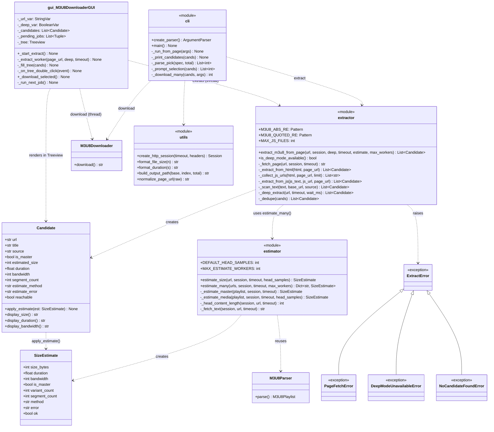
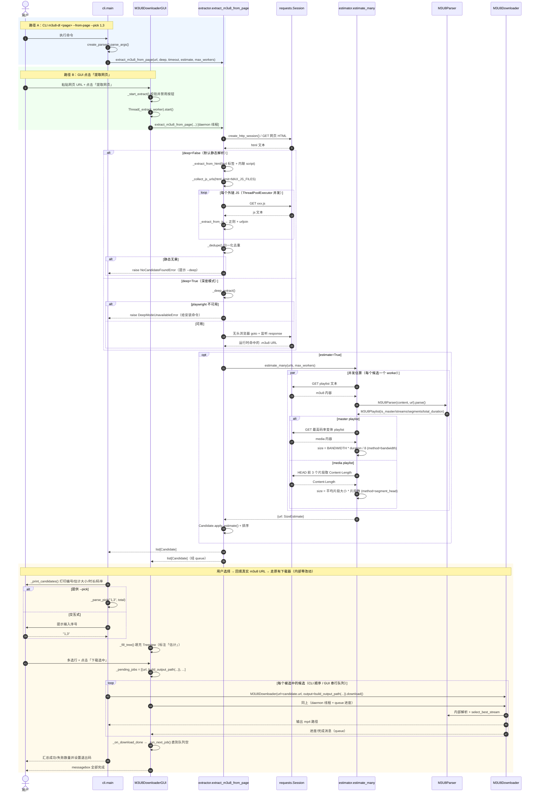
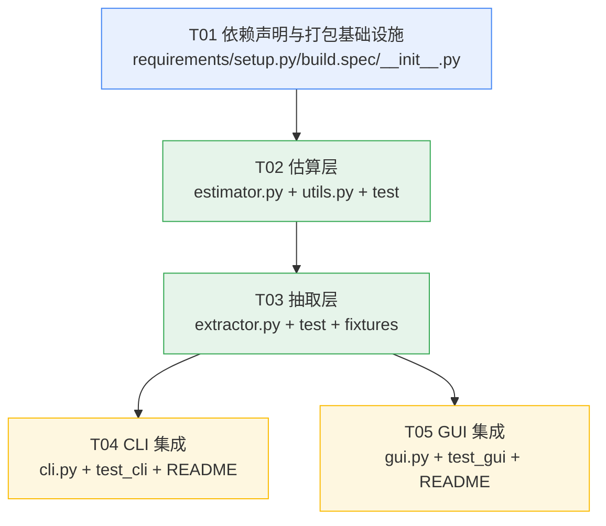

# 系统设计：网页 m3u8 链接抽取与大小估计

- 项目：`m3u8-downloader`（现版本 `1.1.0` → 目标 `1.2.0`）
- 功能：用户粘贴「包含 m3u8 链接的网页 URL」→ 列出页内所有 m3u8 候选 + 估计大小/时长/码率 → CLI / GUI 中选择一个或多个下载
- 约束：**不修改 `M3U8Downloader` 内部逻辑**，仅在入口层（cli / gui）把网页 URL 转成真实 m3u8 URL 列表后回填

---

## 1. 实现方案与框架选型

### 1.1 核心技术难点

| 难点 | 方案 |
|------|------|
| m3u8 链接藏在 JS 字符串拼接里，HTML 静态文本抓不到 | 递归下载页面引用的外链 JS（`<script src>`）+ 内联 `<script>` 文本，统一走同一套正则扫描 |
| 相对路径 / 协议相对路径（`//cdn.x/a.m3u8`、`/hls/a.m3u8`） | 全部 `urljoin(base_url, raw)` 归一化为绝对 URL；base 取 JS 文件自身 URL（若来自 JS）否则取页面 URL |
| 同一条流被多处引用产生重复 | 归一化后按 URL 去重（保留最先出现的 `title`，`source` 取更可信者：`html` > `js` > `deep`） |
| 大小无法从服务器直接得知 | 双通道估算：master 用 `BANDWIDTH × duration ÷ 8`；media 用 `HEAD` 抽样片段的 `Content-Length × 片段数` |
| 逐个估算会让列表加载卡死（一个页面可能 10+ 候选） | `ThreadPoolExecutor` 并发估算，默认 8 并发；UI 明确标注「估计」 |
| SPA / 播放器运行时才生成 m3u8 | 深度模式（无头浏览器）**只留接口**，运行时 `try/except ImportError` 探测 playwright，不可用时给安装指引，绝不硬依赖 |
| 打包成 EXE 不能变大太多 | 只引 `beautifulsoup4`（纯 Python，用内置 `html.parser`，**不引 lxml**）；playwright 完全不进主依赖、不进 `build.spec` |

### 1.2 新增模块与职责

采用**单向依赖**的两个新模块，避免循环导入：

```
cli.py / gui.py  ──►  extractor.py  ──►  estimator.py  ──►  parser.py / utils.py
                            │                                      ▲
                            └──────────────────────────────────────┘
```

| 模块 | 职责 | 依赖 |
|------|------|------|
| `m3u8_downloader/estimator.py`（新） | **纯函数层**。输入 m3u8 URL，输出 `SizeEstimate`（字节/时长/码率）。含并发批处理 `estimate_many()`。**不认识 `Candidate`** | `parser.M3U8Parser`、`utils.create_http_session` |
| `m3u8_downloader/extractor.py`（新） | **抽取层 + 门面**。定义 `Candidate` 与异常体系；静态 HTML 解析、JS 递归扫描、深度模式接口；调用 `estimator.estimate_many()` 回填候选字段 | `estimator`、`utils`、`bs4`(可选) |

> 为什么拆两个而不是一个：估算逻辑与「网页」无关（可被将来的批量任务、`--probe` 单链接体检复用），且拆开后 `estimator.py` 可完全用离线 playlist 文本做单元测试，不需要 mock HTML。

### 1.3 依赖选型决策

**`beautifulsoup4`：引入，但带正则降级**
- 用途：结构化取 `<source src label>`、`<video src>`、`<a href>` 的文本/`label`/`title` 属性 → 填充 `Candidate.title`（"1080P"、"线路二" 这类信息只能从标签属性拿）
- 解析器固定 `html.parser`（Python 内置），**不装 lxml**，避免二进制轮子与 PyInstaller 打包风险
- 降级：`extractor.py` 顶部 `try: from bs4 import BeautifulSoup / except ImportError: BeautifulSoup = None`。为 `None` 时纯正则扫描全文，功能不缺失（只是 `title` 更弱）。这保证老环境 `pip install` 未更新也能跑

**`playwright`：不进主依赖**
- 理由：wheel 本体 ~40MB，`playwright install chromium` 再拉 ~150MB 浏览器内核；本项目主打「双 EXE 绿色小工具」，捆进去会让体积膨胀十几倍，且 PyInstaller 打包浏览器内核极易失败
- 接入方式：`extractor._deep_extract()` 内部 **函数级 import**，`ImportError` → 抛 `DeepModeUnavailableError`，消息体直接给出两行安装命令
- 声明位置：单独 `requirements-deep.txt` + `README.md` 章节；`setup.py` 里作为 `extras_require={"deep": [...]}`

### 1.4 架构模式

- 分层：入口层（cli/gui）→ 门面层（extractor）→ 计算层（estimator）→ 复用层（parser/utils/downloader）
- GUI 沿用现有 **Worker Thread + `queue.Queue` + `root.after(100)` 轮询** 模式，抽取与估算全部在 daemon 线程，主线程只更新 `Treeview`
- 多选下载在 GUI 中用**串行任务队列**（`self._pending_jobs`）复用现有单任务下载管线，不引入并行下载（避免带宽与临时目录冲突）

---

## 2. 文件列表

| 文件 | 动作 | 说明 |
|------|------|------|
| `m3u8_downloader/estimator.py` | **新增** | `SizeEstimate`、`estimate_size()`、`estimate_many()` |
| `m3u8_downloader/extractor.py` | **新增** | `Candidate`、异常体系、`extract_m3u8_from_page()`、深度模式接口 |
| `m3u8_downloader/utils.py` | 修改 | 新增 `build_output_path()`（多选下载文件名编号）、`normalize_page_url()` |
| `m3u8_downloader/cli.py` | 修改 | 新增 `--from-page/--deep/--pick/--list-only/--no-estimate/--extract-workers`；候选列表打印与交互选择；多目标循环下载 |
| `m3u8_downloader/gui.py` | 修改 | 「提取网页」按钮、`ttk.Treeview` 候选表、「下载选中」、深度模式复选框、串行下载队列 |
| `m3u8_downloader/__init__.py` | 修改 | `__version__ = "1.2.0"` |
| `requirements.txt` | 修改 | 增 `beautifulsoup4>=4.12.0` |
| `requirements-deep.txt` | **新增** | 可选深度模式依赖（playwright） |
| `setup.py` | 修改 | `version` 同步 1.2.0；`install_requires` 增 bs4；新增 `extras_require={"deep": ...}` |
| `build.spec` | 修改 | `hiddenimports` 增 `m3u8_downloader.extractor`、`m3u8_downloader.estimator`、`bs4`、`soupsieve`、`html.parser`；`excludes` 增 `playwright` |
| `README.md` | 修改 | 新增「从网页抽取 m3u8」CLI/GUI 用法 + 深度模式安装说明 |
| `tests/test_estimator.py` | **新增** | 离线 playlist 文本驱动的估算单测 |
| `tests/test_extractor.py` | **新增** | HTML/JS 抽取、去重、深度模式不可用降级 |
| `tests/fixtures/sample_page.html` | **新增** | 覆盖 `<source>/<video>/<a>/内联 script/外链 script` 的测试页面 |
| `tests/fixtures/player.js` | **新增** | JS 变量拼接 m3u8 的测试样本 |
| `tests/test_cli.py` | 修改 | 新参数解析、`--pick` 解析、非 TTY 行为 |
| `tests/test_gui.py` | 修改 | 提取按钮回调、Treeview 填充、多选下载队列 |
| `docs/system_design.md` | **新增** | 本文档 |
| `docs/class-diagram.mermaid` / `docs/sequence-diagram.mermaid` | **新增** | 图源 |

---

## 3. 数据结构与接口

### 3.1 类图



### 3.2 `estimator.py` 接口契约

```python
DEFAULT_HEAD_SAMPLES = 3        # media playlist 抽样片段数
MAX_ESTIMATE_WORKERS = 16       # 并发硬上限
DEFAULT_ESTIMATE_WORKERS = 8

@dataclass
class SizeEstimate:
    size_bytes: int = 0        # 估计字节数；0 = 未知
    duration: float = 0.0      # 秒
    bandwidth: int = 0         # bits/s
    is_master: bool = False
    variant_count: int = 0     # master 的变体数
    segment_count: int = 0
    method: str = "unknown"    # "bandwidth" | "segment_head" | "unknown"
    error: str = ""            # 非空 = 估算失败原因（不抛异常）

    @property
    def ok(self) -> bool: ...   # not error and size_bytes > 0

def estimate_size(url: str,
                  session: requests.Session | None = None,
                  timeout: int = 30,
                  head_samples: int = DEFAULT_HEAD_SAMPLES) -> SizeEstimate
```

**`estimate_size` 算法（永不抛异常，失败写 `error`）**

1. `GET url` 取 playlist 文本（很小）；非 200 / 首行不是 `#EXTM3U` → `error="不是有效的 m3u8"`，返回空估算
2. `M3U8Parser(text, url).parse()`
3. **master 分支**（`playlist.is_master`）：
   - `variant_count = len(streams)`；`streams` 已按 `bandwidth` 降序
   - 取 `best = streams[0]`（与 `M3U8Downloader` 内部 `select_best_stream()` 行为一致 → 展示值 = 实际下载值）
   - 拉 `best.url` 的 media playlist，累加 `#EXTINF` 得 `duration`
   - `size_bytes = int(best.bandwidth * duration / 8)`；`bandwidth = best.bandwidth`；`method="bandwidth"`
   - `best.bandwidth == 0` 时退化走 media 分支的 HEAD 抽样
4. **media 分支**：
   - `duration = playlist.total_duration`（`#EXTINF` 累加，parser 已实现）
   - `segment_count = len(playlist.segments)`
   - 对**前 `head_samples` 个片段**发 `HEAD` 取 `Content-Length`（HEAD 返回 405/无长度 → 用 `GET` + `stream=True` 读 header 后立即 `close()`）
   - `avg = mean(有效长度)`；`size_bytes = int(avg * segment_count)`；`method="segment_head"`
   - `bandwidth = int(size_bytes * 8 / duration)`（反推，用于列表展示）
   - 全部抽样失败 → `size_bytes=0`，`method="unknown"`，`error="片段大小探测失败"`，但 `duration/segment_count` 仍有效

```python
def estimate_many(urls: list[str],
                  session: requests.Session | None = None,
                  timeout: int = 30,
                  max_workers: int = DEFAULT_ESTIMATE_WORKERS
                  ) -> dict[str, SizeEstimate]
```
- `ThreadPoolExecutor(max_workers=min(max_workers, MAX_ESTIMATE_WORKERS, len(urls)))`
- 单个 URL 任意异常都被 `try/except` 兜住，转成带 `error` 的 `SizeEstimate`；**批处理整体绝不失败**
- 返回 `{url: SizeEstimate}`，key 为输入原样 URL

### 3.3 `extractor.py` 接口契约

```python
class ExtractError(RuntimeError): ...
class PageFetchError(ExtractError): ...          # 网页拉取失败/非 HTML
class DeepModeUnavailableError(ExtractError): ...# playwright 缺失
class NoCandidateFoundError(ExtractError): ...   # 一个候选都没抽到

MAX_JS_FILES = 10        # 最多递归下载的外链 JS 数量
MAX_PAGE_BYTES = 5 * 1024 * 1024   # 网页/JS 单文件读取上限，防超大文件
DEEP_WAIT_MS = 5000     # 深度模式等待网络静默毫秒数

@dataclass
class Candidate:
    url: str                        # 绝对 URL（已 urljoin 归一化）
    title: str = ""                 # 来自 label/title/<a> 文本/文件名，可空
    source: str = "html"            # "html" | "inline_js" | "js" | "deep"
    is_master: bool = False
    estimated_size: int = 0         # 字节；0 = 未知
    duration: float = 0.0           # 秒
    bandwidth: int = 0              # bits/s
    segment_count: int = 0
    estimate_method: str = "unknown"
    estimate_error: str = ""
    reachable: bool = True          # playlist 是否成功拉取解析

    def apply_estimate(self, est: SizeEstimate) -> None: ...
    def display_size(self) -> str: ...      # "≈ 1.23 GB" / "未知"
    def display_duration(self) -> str: ...  # format_duration 或 "-"
    def display_bandwidth(self) -> str: ... # "2.5 Mbps" 或 "-"

def extract_m3u8_from_page(url: str,
                           session: requests.Session | None = None,
                           deep: bool = False,
                           timeout: int = 30,
                           estimate: bool = True,
                           max_workers: int = 8) -> list[Candidate]
```

**`extract_m3u8_from_page` 流程**

1. `session = session or utils.create_http_session(timeout)`（复用现成浏览器 UA）
2. `deep=True` → 直接走 `_deep_extract()`；否则：
   1. `_fetch_page()`：`GET url`，非 2xx 或 `Content-Type` 明显是 `video/*`/`application/vnd.apple.mpegurl` → 抛 `PageFetchError`（并在消息里提示"这看起来已经是 m3u8 直链，去掉 --from-page 即可"）
   2. `_extract_from_html(html, url)`：
      - bs4 可用：遍历 `<source src>`、`<video src>`、`<a href>`、`<iframe src>`、`<embed src>`、任意标签的 `data-src`/`data-url`；`title` 优先取 `label` → `title` → 标签文本；再对**内联 `<script>` 文本**调 `_scan_text(..., source="inline_js")`
      - bs4 不可用：全文 `_scan_text(html, url, "html")`
   3. `_collect_js_urls(html, url, MAX_JS_FILES)`：取 `<script src>`，同源优先，去掉明显无关的（`jquery`/`analytics`/`gtag`/`polyfill` 黑名单），最多 `MAX_JS_FILES` 个
   4. **并发**（同一个 `ThreadPoolExecutor`，`max_workers` 同参）下载 JS，对每份调 `_extract_from_js(js_text, js_url, page_url)`，其中相对路径基准 = **JS 自身 URL**，失败再回退页面 URL
   5. 合并 → `_dedupe()`
   6. 静态结果为空 → 抛 `NoCandidateFoundError`，消息含 "可尝试 --deep 深度模式（需安装 playwright）"
3. `estimate=True` 且候选非空 → `estimator.estimate_many([c.url ...])` → 逐个 `c.apply_estimate(est)`；`est.error` 非空时 `c.reachable=False`
4. 排序：`reachable` 优先 → `estimated_size` 降序 → `url` 字典序（稳定输出，便于 `--pick` 编号复现）

**正则**（两条互补，扫完取并集）

```python
M3U8_ABS_RE    = re.compile(r'https?://[^\s"\'<>\\)\]]+?\.m3u8[^\s"\'<>\\)\]]*', re.I)
M3U8_QUOTED_RE = re.compile(r'["\']([^"\'\s]+?\.m3u8[^"\'\s]*)["\']', re.I)
```
- `M3U8_QUOTED_RE` 捕获组内可能是相对路径/协议相对路径 → 统一 `urljoin(base_url, raw)`
- 结果过滤：`.m3u8` 后缀或 `.m3u8?` 查询串；长度 < 512；scheme 必须 http/https

**`_deep_extract()`（v1 只留接口 + 文档）**

```python
def is_deep_mode_available() -> bool:
    try:
        import playwright  # noqa
        return True
    except ImportError:
        return False

def _deep_extract(url, timeout=30, wait_ms=DEEP_WAIT_MS) -> list[Candidate]:
    try:
        from playwright.sync_api import sync_playwright
    except ImportError as e:
        raise DeepModeUnavailableError(
            "深度模式需要 playwright，请先执行：\n"
            "  pip install playwright\n"
            "  playwright install chromium"
        ) from e
    # 实现要点（工程师按此写）：
    #   chromium.launch(headless=True) → page.on("response", 收集 url 含 .m3u8)
    #   page.goto(url, wait_until="networkidle", timeout=timeout*1000)
    #   page.wait_for_timeout(wait_ms) → 再扫一次 page.content()
    #   source="deep"
```
- 浏览器启动失败（未 `playwright install`）同样转成 `DeepModeUnavailableError`，消息里带 `playwright install chromium`

### 3.4 CLI 参数设计

保持**向后兼容**：位置参数 `url` 语义不变，用一个开关切换其解释方式（不新增第二个 URL 槽位，避免二者冲突）。

| 参数 | 类型 | 默认 | 说明 |
|------|------|------|------|
| `--from-page` | flag | False | 把位置参数 `url` 当作**网页地址**，先抽取再下载 |
| `--deep` | flag | False | 使用无头浏览器深度抽取（隐含 `--from-page`） |
| `--pick SPEC` | str | `""` | 非交互选择，`1,3` / `1-3` / `1,3-5` / `all`；不给则进入交互式编号输入 |
| `--list-only` | flag | False | 只列出候选与估计大小，不下载（退出码 0） |
| `--no-estimate` | flag | False | 跳过大小估计（秒出列表，`大小/时长` 显示 `-`） |
| `--extract-workers N` | int | 8 | 抽取/估算并发数（钳制到 1..16） |

用法：
```bash
m3u8-dl https://site.com/play/123 --from-page                 # 交互选择
m3u8-dl https://site.com/play/123 --from-page --list-only     # 只看列表
m3u8-dl https://site.com/play/123 --from-page --pick 1,3 -o v.mp4
m3u8-dl https://site.com/play/123 --deep --pick all
```

列表输出（`_print_candidates`）：
```
序号  估计大小      时长      码率        类型    来源  标题/URL
[1]   ≈ 1.21 GB   01:32:10  2.5 Mbps    master  html  1080P
      https://cdn.x/hls/1080/index.m3u8
[2]   ≈ 620.4 MB  01:32:08  1.2 Mbps    media   js    -
      https://cdn.x/hls/720/index.m3u8
[3]   未知         -         -           -       js    (不可达)
      https://cdn.x/hls/dead.m3u8
共 3 个候选（大小为估计值）
```

选择交互：
- `_prompt_selection()`：提示 `请输入序号（如 1 或 1,3 或 1-3，all=全部，q=退出）: `，非法输入最多重试 3 次
- **非 TTY**（`not sys.stdin.isatty()`，如管道/CI）且未给 `--pick` → 打印列表 + 提示 "非交互环境请使用 --pick"，`sys.exit(2)`

多目标下载文件名（`utils.build_output_path`）：
- 单个：沿用 `-o` 原值（经 `normalize_mp4_filename`）
- 多个：`video.mp4` → `video_1.mp4`、`video_2.mp4`（序号为**候选序号**，不是循环下标，便于对应列表）
- 退出码：全部成功 `0`；部分失败 `1`；用户中断 `130`（沿用现状）

### 3.5 GUI 控件设计

窗口从 `720x640` → `900x800`，`minsize(760, 620)`。

1. **URL 行**：标签文案 `m3u8 地址：` → `地址（m3u8 / 网页）：`；`粘贴` 按钮右侧新增 `提取网页` 按钮（`self._extract_btn`，`command=self._start_extract`）
2. **参数设置区**新增复选框 `深度模式（需 playwright）`（`self._deep_var`）。构建时若 `not extractor.is_deep_mode_available()` → `state=tk.DISABLED` 并在 tooltip/日志给安装提示
3. **新增 `ttk.LabelFrame("网页提取结果")`**，插在「操作按钮区」之上：
   - `self._tree = ttk.Treeview(columns=("no","size","duration","bandwidth","type","title","url"), show="headings", selectmode="extended", height=8)`
   - 列宽：`no`40 / `size`110 / `duration`90 / `bandwidth`100 / `type`70 / `title`120 / `url`剩余(stretch)
   - 表头文案：`# / 估计大小 / 时长 / 码率 / 类型 / 标题 / 链接`
   - 垂直 `ttk.Scrollbar`；`grid` + `rowconfigure(weight=1)` 保证缩放
   - 右侧/下方按钮：`下载选中`（`self._download_selected_btn`，初始 `DISABLED`）
   - `<Double-1>` 绑定 `_on_tree_double_click` → 把该行 URL 回填 `self._url_var`（单个立刻下载的快捷路径）
4. **抽取流程**（不阻塞 UI）：
   - `_start_extract()`：校验 URL；`self._extract_btn.configure(state=DISABLED)`；清空 tree；`_log("正在抽取网页中的 m3u8 …")`；起 daemon 线程 `_extract_worker`
   - `_extract_worker()` 内 `extract_m3u8_from_page(...)`，通过既有 `_queue_message` 发新消息类型：
     - `("candidates", list[Candidate])` → `_fill_tree()`
     - `("extract_done", "success"|"empty"|"error")` → 恢复按钮状态、更新 `_status_var`
   - `_handle_message()` 增加这两个分支；`DeepModeUnavailableError` / `NoCandidateFoundError` 的消息文本直接进日志区
5. **多选下载**（`_download_selected`）：
   - `self._tree.selection()` 取多行 → 映射回 `self._candidates`
   - 组装 `self._pending_jobs = [(url, output_path), ...]`，`output_path` 用 `utils.build_output_path(基础名, 候选序号, 总数)`
   - `_run_next_job()` 弹出一个 job → 复用现有 `_download_worker` 管线；`_on_download_done()` 末尾若 `self._pending_jobs` 非空则 `_run_next_job()`，全部完成后才弹 `messagebox`
   - 下载中 `提取网页` / `下载选中` 均 `DISABLED`

---

## 4. 程序调用流程（时序图）



---

## 5. 待明确事项（均已给默认推荐，无需阻塞开发）

| 事项 | 默认决策（工程师按此实现） |
|------|---------------------------|
| GUI 列表是否多选 | **是**，`selectmode="extended"`；多选时**串行**下载，文件名自动加 `_序号` |
| CLI 是否默认开深度模式 | **否**。默认纯静态；`--deep` 显式开启，且 `--deep` 隐含 `--from-page` |
| master playlist 是否展开各变体为独立候选 | **不展开**。master 只占一行，估算值取**最高码率变体**——与 `M3U8Downloader.select_best_stream()` 实际下载行为一致，展示即所得。`类型` 列标 `master` 并在标题追加 `(N 个码率)` |
| 位置 URL 是否自动判别网页/直链 | **不自动**。保持显式 `--from-page`；但当直链下载因"首行不是 #EXTM3U"失败时，追加一行提示 `该地址可能是网页，试试 --from-page` |
| 大小估算抽样片段数 | `3`（前 3 个）。片段时长不均的直播切片可能偏差较大，UI 统一加 `≈` 前缀 |
| 直播流（无 `#EXT-X-ENDLIST`）如何显示 | `duration` 仍按 `#EXTINF` 累加（即已切出的部分），`标题` 追加 `(直播?)`；不特殊处理，v1 接受 |
| 需要登录 / Referer 防盗链的页面 | v1 不做。`create_http_session()` 只带 UA。若抽取到的 m3u8 返回 403，日志提示"可能需要 Referer/Cookie，考虑 --deep" |
| 估算是否缓存 | v1 不缓存（一次会话内 GUI 重复提取同一页会重算）。可作为后续优化 |
| `--pick` 与 `-o` 冲突（多选同名） | `build_output_path` 自动加 `_序号`，不报错 |

---

# Part B：任务分解

## 6. 依赖包

**新增到 `requirements.txt` / `setup.py:install_requires`**
```
beautifulsoup4>=4.12.0    # 静态 HTML 标签/属性解析（纯 Python，用内置 html.parser）
```

**`requirements-deep.txt`（新增，可选，不被主依赖引用）**
```
# 深度模式（无头浏览器）可选依赖，安装后 --deep / GUI「深度模式」才可用
# 安装：pip install -r requirements-deep.txt && playwright install chromium
playwright>=1.40.0
```

**为什么 playwright 不进主依赖**
1. 体积：wheel ~40MB + Chromium 内核 ~150MB，本项目定位「双 EXE 绿色小工具」，捆进去体积膨胀十几倍
2. 打包：PyInstaller 打包浏览器内核路径极易失败，且 `build.spec` 需把 playwright 加进 `excludes` 才能保持 EXE 干净
3. 使用率：绝大多数站点静态解析就能命中，深度模式是兜底能力，不该让所有用户为它付代价
4. 兼容：运行时 `try/except ImportError` 探测，缺失时给出明确安装指引，功能优雅降级而非崩溃

**不引入**：`lxml`（二进制依赖，`html.parser` 足够）、`m3u8` 第三方库（项目已有自研 `parser.py`）

## 7. 任务列表（按依赖顺序）

### T01 — 依赖声明与打包基础设施
- **优先级**：P0　**依赖**：无
- **源文件**：`requirements.txt`（改）、`requirements-deep.txt`（新）、`setup.py`（改）、`build.spec`（改）、`m3u8_downloader/__init__.py`（改）
- **内容**：
  1. `requirements.txt` 增 `beautifulsoup4>=4.12.0`
  2. 新建 `requirements-deep.txt`（内容见 §6）
  3. `setup.py`：`version="1.2.0"`；`install_requires` 增 bs4；新增 `extras_require={"deep": ["playwright>=1.40.0"]}`
  4. `build.spec`：`hiddenimports` 追加 `'m3u8_downloader.extractor'`、`'m3u8_downloader.estimator'`、`'bs4'`、`'soupsieve'`、`'html.parser'`；`excludes` 追加 `'playwright'`
  5. `__init__.py`：`__version__ = "1.2.0"`
- **验收**：`pip install -r requirements.txt` 通过；`python -c "import bs4"` 成功；`pytest` 现有用例全绿

### T02 — 估算层 `estimator.py`
- **优先级**：P0　**依赖**：T01
- **源文件**：`m3u8_downloader/estimator.py`（新）、`m3u8_downloader/utils.py`（改）、`tests/test_estimator.py`（新）
- **内容**：
  1. `estimator.py`：`SizeEstimate` 数据类 + `estimate_size()` + `estimate_many()` + 私有 `_estimate_master/_estimate_media/_head_content_length/_fetch_text`，严格按 §3.2 契约（**永不抛异常，失败写 `error`**）
  2. `utils.py` 新增 `build_output_path(base_output, index, total) -> str`（`total<=1` 原样返回；否则主名后加 `_{index}`，复用 `normalize_mp4_filename`）与 `normalize_page_url(raw) -> str`（补 `https://`、去首尾空白）
  3. `tests/test_estimator.py`：用内联 playlist 文本 + `unittest.mock` 的 fake session 覆盖 master/media/`BANDWIDTH=0` 退化/HEAD 405 回退 GET/非 m3u8 内容/`estimate_many` 部分失败不影响整体/`build_output_path` 编号规则
- **验收**：`pytest tests/test_estimator.py` 全绿；无真实网络请求

### T03 — 抽取层 `extractor.py`
- **优先级**：P0　**依赖**：T02
- **源文件**：`m3u8_downloader/extractor.py`（新）、`tests/test_extractor.py`（新）、`tests/fixtures/sample_page.html`（新）、`tests/fixtures/player.js`（新）
- **内容**：
  1. `extractor.py`：异常体系（`ExtractError` 及 3 个子类）、`Candidate` 数据类（含 `apply_estimate` 与 3 个 `display_*`）、两条正则常量、`extract_m3u8_from_page()` 门面、`_fetch_page/_extract_from_html/_collect_js_urls/_extract_from_js/_scan_text/_dedupe`、`is_deep_mode_available()`、`_deep_extract()`（仅接口 + 清晰 `DeepModeUnavailableError` 提示，按 §3.3 注释要点实现）
  2. bs4 顶部 `try/except ImportError` 降级为纯正则
  3. fixtures：`sample_page.html` 覆盖 `<source label>`、`<video src>`、`<a href>` 相对路径、协议相对 `//cdn/...`、内联 `<script>` 拼接、`<script src="player.js">`、一条重复 URL、一个 jquery 黑名单 JS；`player.js` 覆盖变量拼接场景
  4. `tests/test_extractor.py`：静态抽取命中数与顺序、相对/协议相对归一化、去重与 `source` 优先级、JS 黑名单与 `MAX_JS_FILES` 上限、`estimate=False` 时不发估算请求、无候选抛 `NoCandidateFoundError`、`_deep_extract` 在 playwright 缺失时抛 `DeepModeUnavailableError`（`patch.dict(sys.modules, {"playwright": None})`）、bs4 缺失时降级仍能抽到
- **验收**：`pytest tests/test_extractor.py` 全绿；全程 mock session，零真实网络

### T04 — CLI 集成
- **优先级**：P0　**依赖**：T03
- **源文件**：`m3u8_downloader/cli.py`（改）、`tests/test_cli.py`（改）、`README.md`（改：CLI 章节 + 深度模式安装说明）
- **内容**：
  1. `create_parser()` 新增 6 个参数（§3.4），`--deep` 隐含 `--from-page`
  2. `main()` 分支：`args.from_page or args.deep` → `_run_from_page(args)`，否则走原有直链逻辑（**原路径行为零变化**）
  3. `_run_from_page`：调 `extract_m3u8_from_page` → `_print_candidates` → `--list-only` 直接 `return` → `--pick` 走 `_parse_pick` / 否则 `_prompt_selection`（非 TTY 时 `exit(2)`）→ `_download_many` 循环调 `M3U8Downloader(...).download()`，文件名走 `build_output_path`
  4. `_parse_pick` 支持 `1,3` / `1-3` / 混合 / `all`，越界或非法 → `ValueError`
  5. 异常映射：`DeepModeUnavailableError` → 打印安装命令并 `exit(1)`；`NoCandidateFoundError` → 提示 `--deep` 并 `exit(1)`；`PageFetchError` → `exit(1)`；`KeyboardInterrupt` → `130`
  6. 直链下载失败且 URL 不含 `.m3u8` 时追加提示 `该地址可能是网页，试试 --from-page`
  7. `README.md` 增「从网页抽取 m3u8」小节（CLI 示例、列表输出样例、`--pick` 语法、深度模式两行安装命令）
- **验收**：新参数解析用例全绿；`_parse_pick` 边界用例全绿；`--from-page` 主流程用例（mock extractor + mock M3U8Downloader）全绿；老用例不回归

### T05 — GUI 集成
- **优先级**：P0　**依赖**：T03（与 T04 可并行）
- **源文件**：`m3u8_downloader/gui.py`（改）、`tests/test_gui.py`（改）、`README.md`（改：GUI 章节，与 T04 分节合并时注意不覆盖对方内容）
- **内容**：
  1. `_build_ui()`：窗口 `900x800`/`minsize(760,620)`；URL 行加「提取网页」按钮；参数区加「深度模式」复选框（`is_deep_mode_available()` 为假时 `DISABLED` + 日志提示）；新增「网页提取结果」`LabelFrame` + `Treeview`(7 列, `selectmode="extended"`) + 滚动条 + 「下载选中」按钮；重排 `row` 与 `rowconfigure` 权重（Treeview 与日志区各占一份可伸缩空间）
  2. 新增状态：`self._candidates: list[Candidate]`、`self._pending_jobs: list[tuple[str,str]]`、`self._extracting: bool`
  3. `_start_extract` / `_extract_worker` / `_fill_tree` / `_on_tree_double_click` / `_download_selected` / `_run_next_job`
  4. `_handle_message()` 增 `"candidates"`、`"extract_done"` 两个分支
  5. `_on_download_done()` 末尾：`self._pending_jobs` 非空 → `_run_next_job()`；空 → 恢复按钮并 `messagebox`
  6. Treeview 大小列统一 `≈` 前缀，表头写「估计大小」，抽取完成日志追加一行 `以上大小均为估计值`
  7. `README.md` GUI 使用说明 + 截图占位
- **验收**：`pytest tests/test_gui.py` 在无显示环境下全绿（沿用现有 MagicMock 打桩方式，需为 `ttk.Treeview` 增加 patch）；手工验证：粘贴网页 URL → 提取 → 多选 → 串行下载生成 `xxx_1.mp4`/`xxx_2.mp4`

## 8. 共享知识（跨文件约定）

**单位与语义**
- `estimated_size` / `size_bytes`：**字节（int）**，`0` 表示未知。任何展示都必须走 `utils.format_file_size()` 并加 `≈` 前缀
- `duration`：**秒（float）**，`0.0` 表示未知，展示走 `utils.format_duration()`
- `bandwidth`：**bits per second（int）**，`0` 未知；展示换算 Mbps（`/1e6`，1 位小数）
- `Candidate.source` 取值枚举：`"html"` | `"inline_js"` | `"js"` | `"deep"`；可信度 `html > inline_js > js > deep`（去重保留高可信者）
- `SizeEstimate.method` 取值枚举：`"bandwidth"` | `"segment_head"` | `"unknown"`

**异常约定**
- `estimator` 模块**从不抛业务异常**，所有失败写入 `SizeEstimate.error` 字段（保证并发批处理不被单点拖垮）
- `extractor` 模块只抛 `ExtractError` 子类：`PageFetchError` / `DeepModeUnavailableError` / `NoCandidateFoundError`；入口层按类型给不同提示
- 入口层（cli/gui）必须捕获 `ExtractError` 和裸 `Exception` 两层，GUI 任何异常都不得导致主窗口崩溃
- 沿用现状：`M3U8Downloader` 失败抛 `RuntimeError`；CLI 退出码 `0` 成功 / `1` 失败 / `2` 参数或非交互环境问题 / `130` 用户中断

**并发上限（写成模块常量，不要散落魔数）**
- `estimator.DEFAULT_ESTIMATE_WORKERS = 8`，`MAX_ESTIMATE_WORKERS = 16`（入口传入值一律 `min()` 钳制）
- `estimator.DEFAULT_HEAD_SAMPLES = 3`
- `extractor.MAX_JS_FILES = 10`，`MAX_PAGE_BYTES = 5 * 1024 * 1024`，`DEEP_WAIT_MS = 5000`
- 下载并发沿用现有 `--workers`（默认 8），**与抽取并发相互独立**

**复用纪律（不要重复实现）**
- HTTP 会话必须用 `utils.create_http_session()`（已带浏览器 UA）；不要新建裸 `requests.get`
- m3u8 解析必须用 `parser.M3U8Parser`；`#EXTINF` 累加、`base_url` 计算、`BANDWIDTH/RESOLUTION` 提取、`streams` 按码率降序均已实现
- 格式化必须用 `utils.format_file_size/format_duration/format_speed`
- 输出文件名必须经 `utils.normalize_mp4_filename()`（多目标时经 `build_output_path()`，其内部再调 `normalize_mp4_filename`）
- `M3U8Downloader.__init__` 签名不变、`download()` 不改；入口层只负责把 `url` 换成真实 m3u8 直链

**URL 归一化规则**
- 所有候选 URL 落库前必须是绝对 `http(s)` URL；相对路径 `urljoin(base, raw)`；协议相对 `//host/path` 继承页面 scheme
- 去重 key：完整 URL 字符串（**保留 query**，很多站点 query 里带鉴权 token，剥掉会 403）

## 9. 任务依赖图



- 关键路径：`T01 → T02 → T03`，之后 **T04 与 T05 可并行**
- `T04`/`T05` 都改 `README.md`：约定 T04 负责「CLI 用法 + 深度模式安装」小节，T05 负责「GUI 用法」小节，两者写在不同标题下，避免整文件覆盖
